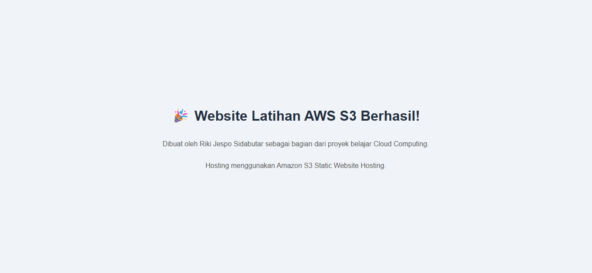

# AWS S3 Static Website Hosting

🔗 **Live Demo**: [Klik di sini untuk lihat website](http://riki-latihan-website-2026.s3-website-ap-southeast-1.amazonaws.com)

## Tujuan
Belajar deploy static website menggunakan Amazon S3.

## Arsitektur
User → S3 Bucket (Static Website Hosting) → HTML page

## Langkah-langkah
1. Membuat S3 bucket dengan konfigurasi public access
2. Mengatur Bucket Policy untuk akses baca publik
3. Mengaktifkan Static Website Hosting
4. Upload file index.html

## Tantangan
- File awal ter-upload kosong, hasil website blank
- Solusi: cek isi file sebelum upload, pastikan HTML valid

## Skill yang dipelajari
- Amazon S3 (bucket, policy, static hosting)
- IAM (least privilege user)
- Budget monitoring (Zero-spend budget)

## Hasil

